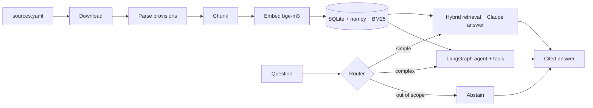
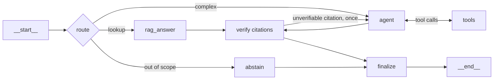

# AI Act Copilot

[](https://github.com/ludvax/ai-act-copilot/actions/workflows/ci.yml)
[](pyproject.toml)
[](LICENSE)

Bilingual (FR/EN) assistant for EU AI regulation — the AI Act, the GDPR, and European
Commission and CNIL guidance — built as a **from-scratch RAG system** with a **LangGraph
agent**, **Langfuse observability** and an **evaluation harness**.

> **Status:** v0.1.0 — the full pipeline works end to end. Two things are honestly not
> done: answer-level metrics have not been run against the live model, and the golden set
> is drafted rather than human-reviewed. See [limitations](docs/architecture.md#limitations).
>
> **Not legal advice.** Answers cite the source provisions so they can be checked; they do
> not replace a lawyer.

## Why this project

Regulatory questions are a good stress test for retrieval-augmented generation: answers
must be grounded in exact provisions ("Article 6(2)", "Annex III"), the corpus is
bilingual, and "I don't know" is often the correct answer. The project is built the way a
Forward Deployed Engineer would build a client system — every architectural choice is
recorded in an [ADR](docs/adr/) and, where possible, justified by evaluation results.

The full walkthrough is in [docs/architecture.md](docs/architecture.md).

## Planned architecture



| Concern | Choice |
| --- | --- |
| Packaging & tooling | uv, ruff, mypy (strict), pytest + hypothesis, pre-commit, GitHub Actions |
| Retrieval | Hand-written: structure-aware chunking, dense (bge-m3 via Ollama) + citation lookup, weighted rank fusion; BM25 implemented and measured |
| Generation | Claude through the native `anthropic` SDK, structured output with validated citations |
| Agent | LangGraph `StateGraph`: router, tool loop, citation verification, SQLite checkpointer |
| Observability | Langfuse: typed observations with real input/output, cost, sessions, PII redaction, eval scores — disabled automatically without keys |
| Evaluation | In-house harness: golden dataset, retrieval metrics, calibrated LLM-as-judge |

## Quickstart

Requires Python 3.12+ and [uv](https://docs.astral.sh/uv/).

```bash
uv sync
cp .env.example .env             # then fill in the keys you have
uv run aiact info                # shows what is configured; no key needed
uv run aiact ingest --download   # fetch and parse the corpus (~2 min)
ollama pull bge-m3               # the embedding model, 1.2 GB
uv run aiact index               # embed the corpus (~18 min, cached afterwards)
uv run aiact search "high-risk classification"   # inspect what retrieval returns
uv run aiact ask "Which AI practices are prohibited?"   # needs an Anthropic key
uv run aiact agent "Is a CV screening tool high-risk, and what must the employer do?"
uv run aiact eval-retrieval -k 5 # retrieval metrics, no API key needed
uv run aiact eval-answers --mode rag --limit 10   # grade answers (spends money)
uv run aiact serve               # HTTP API on http://127.0.0.1:8000
```

The corpus today: 7 documents, 1 287 provisions, 1 896 chunks (median 277 tokens, p95 484).

| Source | Languages | Provisions |
| --- | --- | --- |
| AI Act — Regulation (EU) 2024/1689 | EN, FR | 306 each (180 recitals, 113 articles, 13 annexes) |
| GDPR — Regulation (EU) 2016/679 | EN, FR | 272 each (173 recitals, 99 articles) |
| Commission guidelines — AI system definition, prohibited practices | EN | 130 sections |
| CNIL — AI development checklist | FR | 1 section (unnumbered headings — see [ADR 0003](docs/adr/0003-structure-aware-chunking.md)) |

## A worked example

Retrieval runs entirely locally, so this is reproducible without any API key:

```console
$ uv run aiact search "high-risk classification of AI systems" -k 3
                                Top 3 passages
┌───┬─────────┬───────────────┬───────────────────────────────────────────────┐
│ # │ Signals │ Provision     │ Passage                                       │
├───┼─────────┼───────────────┼───────────────────────────────────────────────┤
│ 1 │ dense   │ ai_act:art:6  │ 1 Irrespective of whether an AI system is     │
│   │         │               │ placed on the market or put into service...   │
│ 2 │ dense   │ ai_act:rct:52 │ As regards stand-alone AI systems, namely     │
│   │         │               │ high-risk AI systems other than those...      │
└───┴─────────┴───────────────┴───────────────────────────────────────────────┘

$ uv run aiact search "article 6 paragraphe 2" -k 2
│ 1 │ dense+reference * │ ai_act:art:6 │ 4 A provider who considers that an ...
```

The `Signals` column shows which retrieval signal found each passage, and `*` marks a
passage pulled in because the question cited it explicitly — so a bad answer can always be
traced back to the step that produced it.

## Measured retrieval

Retrieval is the ceiling on answer quality, so the configuration is chosen by measurement
rather than convention. On the 15-question golden set (`evals/datasets/retrieval_mini.jsonl`),
at k=5, labelled by *provision* so re-chunking never invalidates the dataset:

| Configuration | hit@5 | recall@5 | MRR | nDCG |
| --- | --- | --- | --- | --- |
| BM25 only | 0.47 | 0.47 | 0.36 | 0.39 |
| Dense only | 0.93 | 0.93 | 0.88 | 0.89 |
| Dense + BM25 (equal weights) | 0.87 | 0.87 | 0.66 | 0.71 |
| Dense + BM25 (BM25 x0.4) | 0.87 | 0.87 | 0.66 | 0.71 |
| **Dense + citation lookup (default)** | **0.93** | **0.93** | **0.93** | **0.93** |
| All three signals | 0.93 | 0.93 | 0.73 | 0.78 |

Two findings, both counter to the usual advice:

- **Adding BM25 to dense retrieval makes ranking worse here** (MRR 0.88 → 0.66). Legal text
  shares so much vocabulary that lexical matches rarely discriminate, and they push better
  dense hits out of the top results. BM25 stays implemented, tested and one argument away —
  a corpus with rare identifiers would likely reverse this.
- **Parsing explicit citations is the cheapest win** (MRR 0.88 → 0.93). "What does Article 6(2)
  say?" is a lookup, not a similarity search.

Fifteen questions is a small sample: one case is worth 0.07. M5 re-runs this on the full
golden set before the result is treated as settled.

## The agent

Most questions need one retrieval; some need several — classify a system, then derive the
obligations that follow. A router decides which, so simple questions never pay for the loop
and off-topic questions are refused after one cheap call.



The graph is an explicit `StateGraph` rather than a prebuilt ReAct agent, because the parts
worth trusting are the ones a prebuilt agent hides — see
[ADR 0006](docs/adr/0006-explicit-langgraph-agent.md). Its nodes call the same Claude client
as the non-agent path, so caching, cost accounting and tracing are identical.

- **Tools:** `search_regulations`, `get_provision`, `get_definition`, and `submit_answer` as
  the single terminal action, with strict schemas generated from Pydantic models.
- **Guardrails in the edges:** step limit, cost limit, token limit, per-tool timeout, and
  rejection of a tool call identical to one already made. A halted run says which limit fired.
- **Citations are verified against what the run actually retrieved**, and the agent gets one
  chance to fix a citation it cannot support.
- **Conversations resume**: `--thread <id>` continues an earlier exchange from a SQLite
  checkpoint.

## HTTP API

```bash
uv run aiact serve
curl -s localhost:8000/v1/agent -H 'content-type: application/json'   -d '{"question": "Quelles obligations pour le deployeur d un systeme a haut risque ?"}'
```

`POST /v1/ask` runs the single-retrieval path, `POST /v1/agent` the graph (pass `thread_id`
to continue a conversation), `GET /health` is the liveness probe. Both answer paths return
the citations, the route, the token usage and the cost of the call.

The `Dockerfile` ships the code but not the index: build it once with `aiact ingest` and
`aiact index`, then mount `data/` and point `AIACT_OLLAMA_BASE_URL` at your Ollama instance.

## Observability

A trace has to answer "why did it say that?", not just "how long did it take?". Every
observation therefore carries what it received and what it produced, and is typed so it can
be filtered — see [ADR 0008](docs/adr/0008-tracing-that-can-be-audited.md).

```
ask                                          tags [cli, ask] · environment · release
└── answer-question              chain       the question -> the answer and its citations
    ├── retrieve-passages        retriever   each passage, its provisions, which signal found it
    │   └── embed-texts          embedding   bge-m3
    └── generate-answer          generation  the prompt the model saw -> the structured answer,
                                             with tokens, cache reads and cost
```

- **Names describe the job, not the model.** `generate-answer`, never `claude`: dashboards
  and judges target observations by name, and a name that encodes the model breaks the day
  it changes. The name is attached before the call, so failures arrive named and readable.
- **One trace is one question.** A follow-up on the same `--thread` is its own trace, tied
  to the first by a Langfuse session.
- **Evaluation writes back.** Each golden case is its own trace and carries its grades as
  Langfuse scores, so quality sits next to latency and cost instead of in a separate file.
- **Personal data is redacted before export.** Questions about EU data-protection rules
  contain personal data; emails, phone numbers, IBANs, card numbers and French
  social-security numbers are replaced at the export boundary. Legal citations are left
  intact, and both directions are tested.
- **Nothing leaves the machine without keys.** No credentials means a disabled client and a
  no-op decorator, which is how the tests and CI run.

The instrumentation is tested the same way the rest of the code is: the Langfuse SDK is
OpenTelemetry underneath, so `tests/unit/test_trace_shape.py` points a real client at an
in-memory exporter and asserts the tree, the types, the input and output, the cost, the
session and the redaction — no account, no network, on every commit.

## Evaluation

Every architectural claim in this repository is supposed to be measured, which only means
something if the measurement is trustworthy. The harness is built accordingly:

- **Deterministic checks first.** Whether the answer cited provisions the run actually
  retrieved, whether it abstained when it should have, and whether the router picked the
  labelled path are facts — computed in code, for free, on every run. Judges are reserved
  for grounding and substantive correctness.
- **Two judges on separate prompts.** Faithfulness sees the passages but not the reference
  answer; correctness sees the reference but not the passages. Both score 0–2.
- **The judges are themselves checked.** `aiact eval-calibrate` compares them with human
  scores and reports Cohen's kappa — chance-corrected, because most answers score 2 and a
  judge that always says "2" would otherwise look excellent. Below 0.4 it is reported as
  unusable rather than quietly trusted.
- **Abstention is measured, not assumed.** The golden set contains out-of-scope questions
  and false premises, where declining is the correct answer.
- **Reports carry their caveats**: dataset, human-review rate, judge model and run cost.

```bash
uv run aiact eval-answers --mode agent --limit 10
uv run aiact eval-calibrate evals/results/<run>/run.json --labels evals/human_labels.jsonl
```

The golden set is `evals/datasets/golden_v1.jsonl`: 40 cases in French and English, labelled
by provision, spanning lookups, definitions, explicit citations, scenarios, dates,
cross-regulation questions, out-of-scope questions and false premises. **It is drafted and
not yet human-reviewed**, so answer-level numbers are provisional and every report says so.
See [ADR 0007](docs/adr/0007-evaluation-harness.md).

## Data sources and licences

Legal texts are fetched by CELEX id from the EU Publications Office (Cellar), never scraped
from the EUR-Lex website — see [ADR 0002](docs/adr/0002-fetch-legal-texts-from-cellar.md).
Raw files are not versioned; `data/sources.yaml` plus recorded checksums make ingestion
reproducible.

- EU legislation and Commission guidelines: © European Union, reuse authorised with
  acknowledgement of the source (Commission Decision 2011/833/EU) — https://eur-lex.europa.eu
- CNIL guidance: Licence Ouverte / Open Licence (Etalab), attribution required — https://www.cnil.fr

## Development

```bash
uv run ruff check .
uv run ruff format --check .
uv run mypy
uv run pytest
pre-commit install     # runs the same checks on every commit
```

## Roadmap

- [x] **M0** Foundations — packaging, tooling, configuration, tracing bootstrap, CI
- [x] **M1** Ingestion & chunking — Cellar downloads, provision-level parsing, two chunkers
- [x] **M2** Embeddings & retrieval — cached bge-m3 vectors, numpy index, BM25, measured fusion
- [x] **M3** LLM client, grounded generation with verified citations, tracing
- [x] **M4** LangGraph agent & HTTP API — router, tools, guardrails, checkpoints, FastAPI
- [x] **M5** Evaluation harness — golden set, judges, calibration, reports
- [x] **M6** Documentation & v0.1.0 release — architecture write-up, ADRs, worked example
- [x] **Observability audit** — traces audited against Langfuse's guidance: typed
  observations, real input/output, PII redaction, eval scores, offline trace tests

## License

[MIT](LICENSE)
