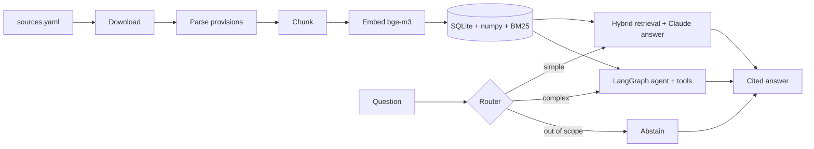
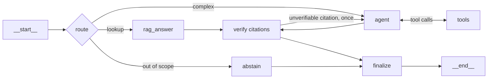

# AI Act Copilot

Bilingual (FR/EN) assistant for EU AI regulation — the AI Act, the GDPR, and European
Commission and CNIL guidance — built as a **from-scratch RAG system** with a **LangGraph
agent**, **Langfuse observability** and an **evaluation harness**.

> **Status:** work in progress — Milestone 4 (agent and API). See the [roadmap](#roadmap).
>
> **Not legal advice.** Answers cite the source provisions so they can be checked; they do
> not replace a lawyer.

## Why this project

Regulatory questions are a good stress test for retrieval-augmented generation: answers
must be grounded in exact provisions ("Article 6(2)", "Annex III"), the corpus is
bilingual, and "I don't know" is often the correct answer. The project is built the way a
Forward Deployed Engineer would build a client system — every architectural choice is
recorded in an [ADR](docs/adr/) and, where possible, justified by evaluation results.

## Planned architecture



| Concern | Choice |
| --- | --- |
| Packaging & tooling | uv, ruff, mypy (strict), pytest + hypothesis, pre-commit, GitHub Actions |
| Retrieval | Hand-written: structure-aware chunking, dense (bge-m3 via Ollama) + citation lookup, weighted rank fusion; BM25 implemented and measured |
| Generation | Claude through the native `anthropic` SDK, structured output with validated citations |
| Agent | LangGraph `StateGraph`: router, tool loop, citation verification, SQLite checkpointer |
| Observability | Langfuse (traces, token usage, cost, latency) — disabled automatically without keys |
| Evaluation | In-house harness: golden dataset, retrieval metrics, calibrated LLM-as-judge |

## Quickstart

Requires Python 3.12+ and [uv](https://docs.astral.sh/uv/).

```bash
uv sync
cp .env.example .env             # then fill in the keys you have
uv run aiact info                # shows what is configured; no key needed
uv run aiact ingest --download   # fetch and parse the corpus (~2 min)
ollama pull bge-m3               # the embedding model, 1.2 GB
uv run aiact index               # embed the corpus (~18 min, cached afterwards)
uv run aiact search "high-risk classification"   # inspect what retrieval returns
uv run aiact ask "Which AI practices are prohibited?"   # needs an Anthropic key
uv run aiact agent "Is a CV screening tool high-risk, and what must the employer do?"
uv run aiact eval-retrieval -k 5 # measure retrieval configurations
uv run aiact serve               # HTTP API on http://127.0.0.1:8000
```

The corpus today: 7 documents, 1 287 provisions, 1 896 chunks (median 277 tokens, p95 484).

| Source | Languages | Provisions |
| --- | --- | --- |
| AI Act — Regulation (EU) 2024/1689 | EN, FR | 306 each (180 recitals, 113 articles, 13 annexes) |
| GDPR — Regulation (EU) 2016/679 | EN, FR | 272 each (173 recitals, 99 articles) |
| Commission guidelines — AI system definition, prohibited practices | EN | 130 sections |
| CNIL — AI development checklist | FR | 1 section (unnumbered headings — see [ADR 0003](docs/adr/0003-structure-aware-chunking.md)) |

## Measured retrieval

Retrieval is the ceiling on answer quality, so the configuration is chosen by measurement
rather than convention. On the 15-question golden set (`evals/datasets/retrieval_mini.jsonl`),
at k=5, labelled by *provision* so re-chunking never invalidates the dataset:

| Configuration | hit@5 | recall@5 | MRR | nDCG |
| --- | --- | --- | --- | --- |
| BM25 only | 0.47 | 0.47 | 0.36 | 0.39 |
| Dense only | 0.93 | 0.93 | 0.88 | 0.89 |
| Dense + BM25 (equal weights) | 0.87 | 0.87 | 0.66 | 0.71 |
| Dense + BM25 (BM25 x0.4) | 0.87 | 0.87 | 0.66 | 0.71 |
| **Dense + citation lookup (default)** | **0.93** | **0.93** | **0.93** | **0.93** |
| All three signals | 0.93 | 0.93 | 0.73 | 0.78 |

Two findings, both counter to the usual advice:

- **Adding BM25 to dense retrieval makes ranking worse here** (MRR 0.88 → 0.66). Legal text
  shares so much vocabulary that lexical matches rarely discriminate, and they push better
  dense hits out of the top results. BM25 stays implemented, tested and one argument away —
  a corpus with rare identifiers would likely reverse this.
- **Parsing explicit citations is the cheapest win** (MRR 0.88 → 0.93). "What does Article 6(2)
  say?" is a lookup, not a similarity search.

Fifteen questions is a small sample: one case is worth 0.07. M5 re-runs this on the full
golden set before the result is treated as settled.

## The agent

Most questions need one retrieval; some need several — classify a system, then derive the
obligations that follow. A router decides which, so simple questions never pay for the loop
and off-topic questions are refused after one cheap call.



The graph is an explicit `StateGraph` rather than a prebuilt ReAct agent, because the parts
worth trusting are the ones a prebuilt agent hides — see
[ADR 0006](docs/adr/0006-explicit-langgraph-agent.md). Its nodes call the same Claude client
as the non-agent path, so caching, cost accounting and tracing are identical.

- **Tools:** `search_regulations`, `get_provision`, `get_definition`, and `submit_answer` as
  the single terminal action, with strict schemas generated from Pydantic models.
- **Guardrails in the edges:** step limit, cost limit, token limit, per-tool timeout, and
  rejection of a tool call identical to one already made. A halted run says which limit fired.
- **Citations are verified against what the run actually retrieved**, and the agent gets one
  chance to fix a citation it cannot support.
- **Conversations resume**: `--thread <id>` continues an earlier exchange from a SQLite
  checkpoint.

## HTTP API

```bash
uv run aiact serve
curl -s localhost:8000/v1/agent -H 'content-type: application/json'   -d '{"question": "Quelles obligations pour le deployeur d un systeme a haut risque ?"}'
```

`POST /v1/ask` runs the single-retrieval path, `POST /v1/agent` the graph (pass `thread_id`
to continue a conversation), `GET /health` is the liveness probe. Both answer paths return
the citations, the route, the token usage and the cost of the call.

The `Dockerfile` ships the code but not the index: build it once with `aiact ingest` and
`aiact index`, then mount `data/` and point `AIACT_OLLAMA_BASE_URL` at your Ollama instance.

## Data sources and licences

Legal texts are fetched by CELEX id from the EU Publications Office (Cellar), never scraped
from the EUR-Lex website — see [ADR 0002](docs/adr/0002-fetch-legal-texts-from-cellar.md).
Raw files are not versioned; `data/sources.yaml` plus recorded checksums make ingestion
reproducible.

- EU legislation and Commission guidelines: © European Union, reuse authorised with
  acknowledgement of the source (Commission Decision 2011/833/EU) — https://eur-lex.europa.eu
- CNIL guidance: Licence Ouverte / Open Licence (Etalab), attribution required — https://www.cnil.fr

## Development

```bash
uv run ruff check .
uv run ruff format --check .
uv run mypy
uv run pytest
pre-commit install     # runs the same checks on every commit
```

## Roadmap

- [x] **M0** Foundations — packaging, tooling, configuration, tracing bootstrap, CI
- [x] **M1** Ingestion & chunking — Cellar downloads, provision-level parsing, two chunkers
- [x] **M2** Embeddings & retrieval — cached bge-m3 vectors, numpy index, BM25, measured fusion
- [x] **M3** LLM client, grounded generation with verified citations, tracing
- [x] **M4** LangGraph agent & HTTP API — router, tools, guardrails, checkpoints, FastAPI
- [ ] **M5** Evaluation harness & experiments
- [ ] **M6** Documentation & v0.1.0 release

## License

[MIT](LICENSE)
