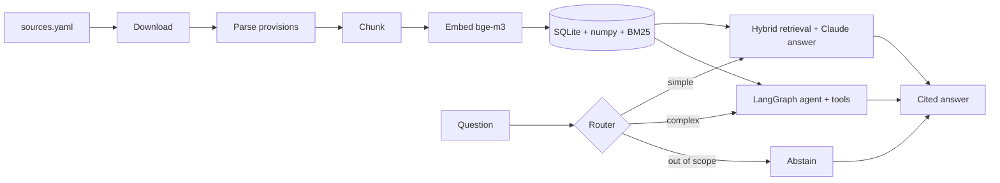

# AI Act Copilot

Bilingual (FR/EN) assistant for EU AI regulation — the AI Act, the GDPR, and European
Commission and CNIL guidance — built as a **from-scratch RAG system** with a **LangGraph
agent**, **Langfuse observability** and an **evaluation harness**.

> **Status:** work in progress — Milestone 0 (foundations). See the [roadmap](#roadmap).
>
> **Not legal advice.** Answers cite the source provisions so they can be checked; they do
> not replace a lawyer.

## Why this project

Regulatory questions are a good stress test for retrieval-augmented generation: answers
must be grounded in exact provisions ("Article 6(2)", "Annex III"), the corpus is
bilingual, and "I don't know" is often the correct answer. The project is built the way a
Forward Deployed Engineer would build a client system — every architectural choice is
recorded in an [ADR](docs/adr/) and, where possible, justified by evaluation results.

## Planned architecture



| Concern | Choice |
| --- | --- |
| Packaging & tooling | uv, ruff, mypy (strict), pytest + hypothesis, pre-commit, GitHub Actions |
| Retrieval | Hand-written: structure-aware chunking, BM25 + dense (bge-m3 via Ollama), RRF fusion |
| Generation | Claude through the native `anthropic` SDK, structured output with validated citations |
| Agent | LangGraph `StateGraph`: router, tool loop, citation verification, SQLite checkpointer |
| Observability | Langfuse (traces, token usage, cost, latency) — disabled automatically without keys |
| Evaluation | In-house harness: golden dataset, retrieval metrics, calibrated LLM-as-judge |

## Quickstart

Requires Python 3.12+ and [uv](https://docs.astral.sh/uv/).

```bash
uv sync
cp .env.example .env   # then fill in the keys you have
uv run aiact info
uv run aiact ingest --download   # builds the corpus into data/index/corpus.db
```

The corpus today: 7 documents, 1 287 provisions, 1 896 chunks (median 277 tokens, p95 484).

| Source | Languages | Provisions |
| --- | --- | --- |
| AI Act — Regulation (EU) 2024/1689 | EN, FR | 306 each (180 recitals, 113 articles, 13 annexes) |
| GDPR — Regulation (EU) 2016/679 | EN, FR | 272 each (173 recitals, 99 articles) |
| Commission guidelines — AI system definition, prohibited practices | EN | 130 sections |
| CNIL — AI development checklist | FR | 1 section (unnumbered headings — see [ADR 0003](docs/adr/0003-structure-aware-chunking.md)) |

## Data sources and licences

Legal texts are fetched by CELEX id from the EU Publications Office (Cellar), never scraped
from the EUR-Lex website — see [ADR 0002](docs/adr/0002-fetch-legal-texts-from-cellar.md).
Raw files are not versioned; `data/sources.yaml` plus recorded checksums make ingestion
reproducible.

- EU legislation and Commission guidelines: © European Union, reuse authorised with
  acknowledgement of the source (Commission Decision 2011/833/EU) — https://eur-lex.europa.eu
- CNIL guidance: Licence Ouverte / Open Licence (Etalab), attribution required — https://www.cnil.fr

## Development

```bash
uv run ruff check .
uv run ruff format --check .
uv run mypy
uv run pytest
pre-commit install     # runs the same checks on every commit
```

## Roadmap

- [x] **M0** Foundations — packaging, tooling, configuration, tracing bootstrap, CI
- [x] **M1** Ingestion & chunking — Cellar downloads, provision-level parsing, two chunkers
- [ ] **M2** Embeddings & hybrid retrieval
- [ ] **M3** LLM client, grounded generation, end-to-end tracing
- [ ] **M4** LangGraph agent & HTTP API
- [ ] **M5** Evaluation harness & experiments
- [ ] **M6** Documentation & v0.1.0 release

## License

[MIT](LICENSE)
