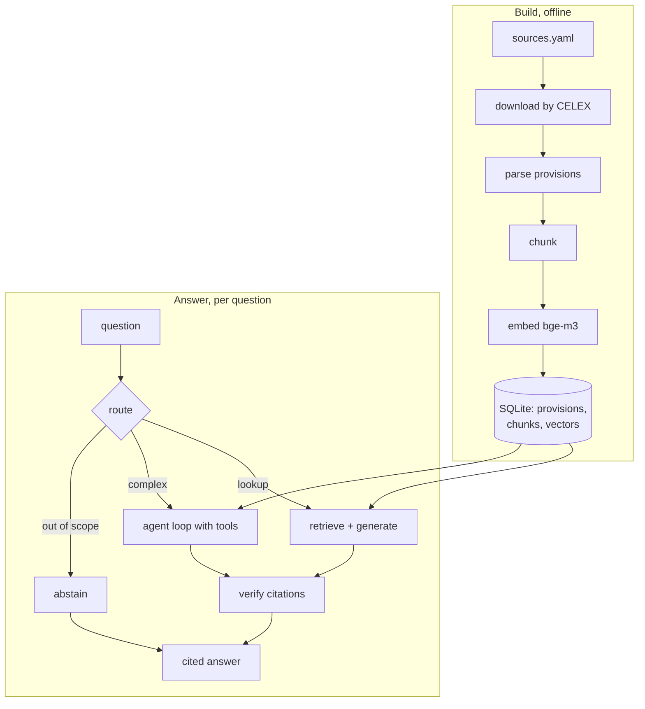
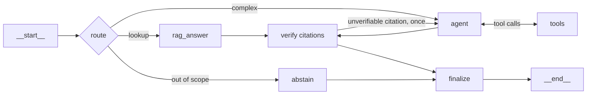

# Architecture

How the system is put together, and why each part is the way it is. Decisions with
alternatives worth arguing about live in [ADRs](adr/); this document is the walkthrough.

## The problem

Regulatory questions are an unusually strict test for retrieval-augmented generation:

- **Answers must be attributable.** "Article 6(2)" is either right or wrong, and a reader
  cannot tell a real citation from an invented one without opening the Official Journal —
  exactly the work the system is meant to save.
- **The corpus is bilingual.** The same provision exists in French and English, and users
  ask in either.
- **"I don't know" is often correct.** The corpus covers the AI Act, the GDPR and EU
  guidance; anything else must be refused rather than improvised.
- **Some questions are lookups, some are reasoning.** "What is an AI system?" needs one
  retrieval. "Is my CV screening tool high-risk, and what must I do?" needs several.

## The unit that holds it together: the provision

Everything is keyed on **provisions** — `ai_act:art:6`, `gdpr:art:35`, `ai_act:anx:III` —
rather than on chunks:

- chunks record which provisions they cover;
- answers cite provisions;
- the evaluation dataset labels provisions.

That single choice is what makes chunking strategies comparable: re-chunk the corpus and
the golden set is still valid. Chunk ids would have made every experiment a dataset
migration.

## Pipeline

## Ingestion — `ingestion/`

Legal texts are fetched **by CELEX identifier from Cellar**, the EU Publications Office
repository, using HTTP content negotiation — not scraped from the EUR-Lex website
([ADR 0002](adr/0002-fetch-legal-texts-from-cellar.md)). Both acts come back as structured
XHTML in the same markup despite eight years between them, so one parser covers the whole
legal corpus.

`parsers/eurlex.py` turns that markup into provisions: recitals, chapters and sections,
articles with their numbered paragraphs, and annexes. Enumerations ("(a) …") are two-column
tables, and footnotes are nested *inside* articles — both handled, both discovered by
reading the real output rather than the specification.

`parsers/pdf.py` handles guidance documents, which have sections instead of articles. Real
Commission PDFs required defensive filtering: table-of-contents lines were being parsed as
sections *and stealing the real section numbers*, and footnote markers were read as
headings.

Downloads are content-addressed (SHA-256 in `data/raw/downloads.json`), so re-running
ingestion is free and a changed source is visible.

**Result:** 7 documents, 1 287 provisions.

## Chunking — `chunking/`

Two strategies, both implemented so they can be compared
([ADR 0003](adr/0003-structure-aware-chunking.md)):

- `fixed.py` — sliding token windows over the raw text, the usual tutorial approach, kept as
  the baseline.
- `structural.py` — the default: follows the boundaries the legislator already provides. A
  chunk never spans two provisions, so citations stay exact, and each carries a breadcrumb
  header ("AI Act > Chapter III > Article 6 — Classification rules") that is embedded with
  the text, so an isolated paragraph still says what it belongs to.

Sizes are measured in **bge-m3 tokens** — the embedding model decides what fits, so it does
the counting — with the tokenizer revision pinned for reproducible boundaries. `max_tokens`
is a target rather than a limit: a short trailing fragment is folded back into the previous
chunk instead of becoming a three-token chunk that carries no signal.

**Result:** 1 896 chunks, median 277 tokens, p95 484.

## Retrieval — `retrieval/`, `store/`

Three signals, combined by weighted reciprocal rank fusion, with **which two are on by
default decided by measurement** ([ADR 0004](adr/0004-numpy-index-and-hybrid-retrieval.md)):

| Signal | Good at | Fails at |
| --- | --- | --- |
| Dense (bge-m3, local Ollama) | paraphrase, cross-language | drifting to a neighbouring article |
| Reference lookup (regex) | "Article 6(2)", "Annexe III" | anything not explicitly cited |
| BM25 (hand-written Okapi) | rare terms, exact wording | shared legal vocabulary |

Measured on the golden set, adding BM25 to dense retrieval *lowers* ranking quality
(MRR 0.88 → 0.66) while parsing citations raises it (0.88 → 0.93). The default is therefore
references + dense; BM25 remains implemented, tested and one argument away.

Fusion is by **rank, not score**: a BM25 score and a cosine similarity are not on the same
scale, and normalising them is guesswork. Results are de-duplicated per provision, so one
article cannot occupy every slot in both languages.

Vectors live as BLOBs in the same SQLite file and load into one numpy matrix — 1 896 × 1 024
floats is about 8 MB, and a query is a single matrix product. Embeddings are cached by text
hash, so re-chunking only re-embeds passages whose text actually changed.

## Generation — `generation/`, `llm/`

One LLM layer serves the RAG path, the agent and the judges
([ADR 0005](adr/0005-grounded-generation.md)), so prompt caching, refusal handling, cost
accounting and tracing exist once. Claude is called through the official SDK.

The answer comes back as **structured output** — `{answer, citations, abstained}` — so
citations are data and abstention is a boolean rather than a phrase to pattern-match. Every
citation is then **verified in code** against the passages actually retrieved; unsupported
ones are dropped and counted, which turns "it cites Article 99" from an undetected error
into a measured one.

Prompts are files (`prompts/*.md`), and each trace records `answer_v1@<hash>`, so an edited
prompt is visibly a different prompt.

Cost is computed from the usage the API reports, not estimated: cache reads bill at a tenth
of the input rate, and `usage.cache_read_tokens` proves the caching works.

## The agent — `agent/`

An explicit LangGraph `StateGraph` rather than a prebuilt ReAct agent
([ADR 0006](adr/0006-explicit-langgraph-agent.md)), because the parts worth trusting — the
routing, the citation check, the guardrails — are exactly what a prebuilt agent hides.

- **Four tools** with strict JSON schemas generated from Pydantic models:
  `search_regulations`, `get_provision`, `get_definition`, and `submit_answer` as the single
  terminal action.
- **Guardrails live in the edges**, not in prompt wording: step, cost and token limits, a
  per-tool timeout, and rejection of a tool call identical to one already made. A halted run
  reports which limit fired.
- **State is append-only** — thinking blocks and tool calls are replayed to the API verbatim
  — and checkpointed to SQLite, so a `thread_id` continues a conversation.
- Nodes call the project's own Claude client, keeping one LLM layer for everything.

## Observability — `observability/tracing.py`

Langfuse, wired from the first milestone rather than added at the end. Every stage is a
span: retrieval, generation, each graph node, each tool, each judge. Generations carry the
model, token counts (including cache reads), computed cost and the prompt version.

Without keys the client is created **disabled**, so `@observe` becomes a silent no-op and
nothing leaves the machine — which is how tests and CI run. The tracing vendor is referenced
in exactly one module.

## Evaluation — `evaluation/`

Deterministic checks first, judges second
([ADR 0007](adr/0007-evaluation-harness.md)):

| Check | How |
| --- | --- |
| Retrieval quality | hit@k, recall@k, MRR, nDCG on provision labels |
| Citation validity | are cited provisions ones the run actually retrieved? |
| Abstention | did it decline exactly when the label says it should? |
| Routing | did the router pick the labelled path? |
| Grounding | LLM judge, sees passages but not the reference answer |
| Correctness | LLM judge, sees the reference but not the passages |

The judges are themselves checked against human scores with Cohen's kappa — chance-corrected,
because most answers score 2 and a judge that always said "2" would look excellent. Below
0.4 the tool reports the judge as unusable.

## Operational notes

| | |
| --- | --- |
| Build the corpus | `aiact ingest --download`, about 2 minutes |
| Build the index | `aiact index`, about 18 minutes on CPU, cached afterwards |
| Index size | ~8 MB of vectors, one SQLite file |
| Query latency | milliseconds for retrieval, dominated by the model call |
| Tests | 154, offline, no API key required |
| CI | ruff, mypy strict, pytest on Linux (3.12, 3.13) and Windows |

## Limitations

Stated plainly, because a portfolio that hides these is less useful than one that does not:

- **Answer-level metrics have not been run against the live model.** The harness is tested
  offline with a scripted model; the faithfulness, correctness, cost and latency columns
  wait on API credit.
- **The golden set is drafted, not human-reviewed.** 40 cases, labels mechanically verified
  against the corpus, but the reference answers need a domain read. Reports say so.
- **The judges are uncalibrated** until roughly twenty human labels exist.
- **The CNIL guidance collapses to one section**: its headings are not numbered, so the PDF
  parser cannot split it. Its content is indexed but cited imprecisely.
- **The retrieval comparison rests on 15 questions**, where one case is worth 0.07. It is
  re-run on the full set before being treated as settled.
- **No reranker**, deliberately: it earns its place only if evaluation shows retrieval, not
  generation, is the bottleneck.

## Decision index

| ADR | Decision |
| --- | --- |
| [0001](adr/0001-record-architecture-decisions.md) | Record decisions as ADRs |
| [0002](adr/0002-fetch-legal-texts-from-cellar.md) | Fetch from Cellar, not by scraping |
| [0003](adr/0003-structure-aware-chunking.md) | Structure-aware chunking, provision-level labels |
| [0004](adr/0004-numpy-index-and-hybrid-retrieval.md) | numpy index; measured signal mix |
| [0005](adr/0005-grounded-generation.md) | Structured answers, verified citations, abstention |
| [0006](adr/0006-explicit-langgraph-agent.md) | Explicit graph, own LLM client |
| [0007](adr/0007-evaluation-harness.md) | In-house harness, calibrated judges |
